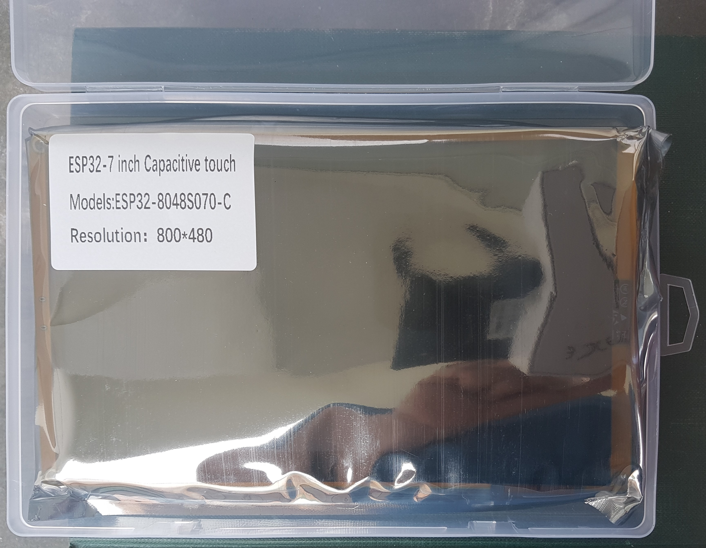
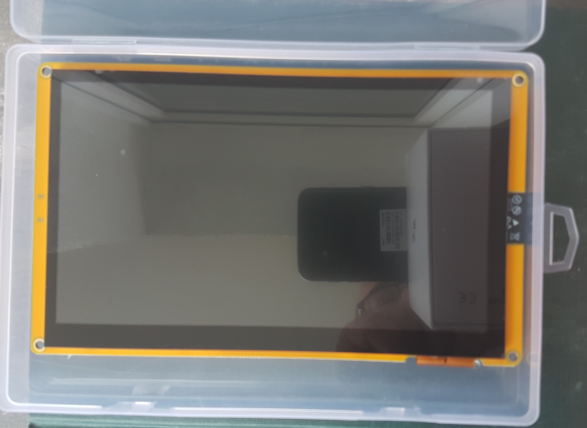

# 7.0 inch ESP32-8048S070

## LIST PINS

#### LCD PINS

| Pins    | Usage     |
| ------- | --------- |
| GPIO 1  | LCD_G5    |
| GPIO 2  | TFT_BL    |
| GPIO 3  | LCD_G2    |
| GPIO 4  | LCD_B4    |
| GPIO 5  | LCD_B3    |
| GPIO 6  | LCD_B2    |
| GPIO 7  | LCD_B1    |
| GPIO 8  | LCD_G3    |
| GPIO 9  | LCD_G0    |
| GPIO 14 | LCD_R0    |
| GPIO 15 | LCD_B0    |
| GPIO 16 | LCD_G4    |
| GPIO 21 | LCD_R1    |
| GPIO 39 | LCD_HSYNC |
| GPIO 40 | LCD_VSYNC |
| GPIO 41 | LCD_DE    |
| GPIO 42 | LCD_PCLK  |
| GPIO 45 | LCD_R4    |
| GPIO 46 | LCD_G1    |
| GPIO 47 | LCD_R2    |
| GPIO 48 | LCD_R3    |

#### SDcard Pins

| Pins    | Usage   |
| ------- | ------- |
| GPIO 10 | SD_CS   |
| GPIO 11 | SD_MOSI |
| GPIO 12 | SD_SCK  |
| GPIO 13 | SD_MISO |

#### TouchScreen Pins (GT911)

| Pins    | Usage                 |
| ------- | --------------------- |
| GPIO 18 | CTP_INT (need hw mod) |
| GPIO 19 | CTP_SDA               |
| GPIO 20 | CTP_SCL               |
| GPIO 38 | CTP_RST               |

- Install a 0 ohm resistor or solder bridge across R17. This connects the GT911’s INT pin to GPIO18.
- (If installed) Remove (pull-up) resistor R5 (GPIO18 to 3V3). The 
  GT911’s INT pin is not strong enough to drive GPIO18 low with this 
  resistor installed.
- (If installed) Remove U1 (XPT2046). This is not needed for the 
  Capacitive touch panel and may conflict with GPIO18 if left on the 
  board.

## Image

## Youtube

[ESP32 WITH 7 INCH CAPPACITIVE LCD #shorts - YouTube](https://youtube.com/shorts/khs0KEFH_Zk?feature=share)
